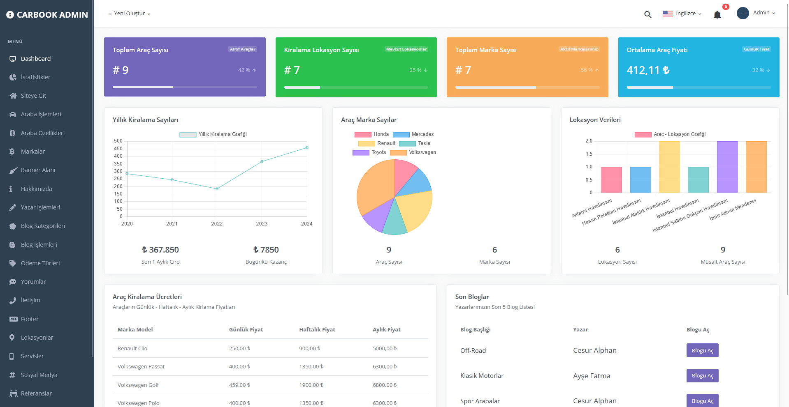
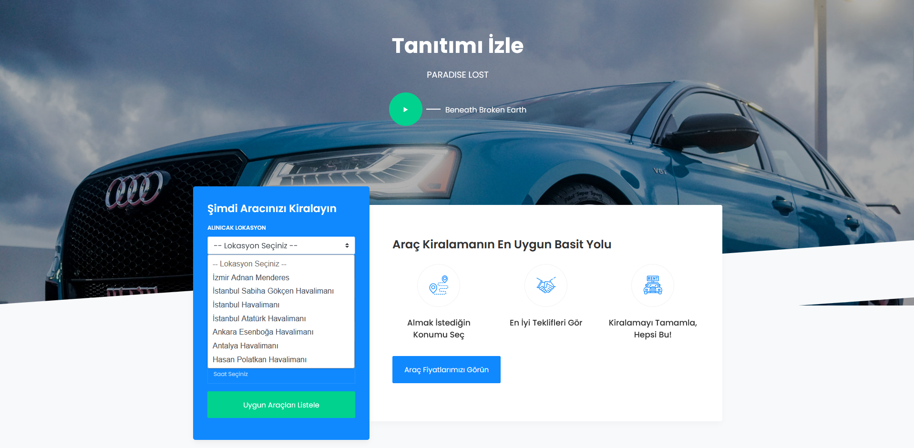
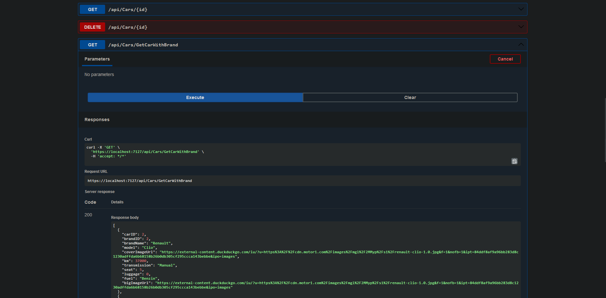
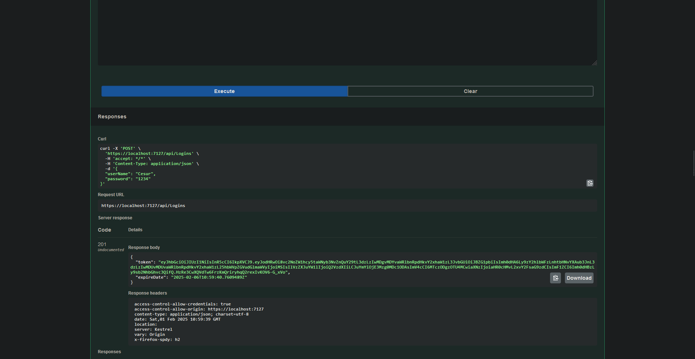
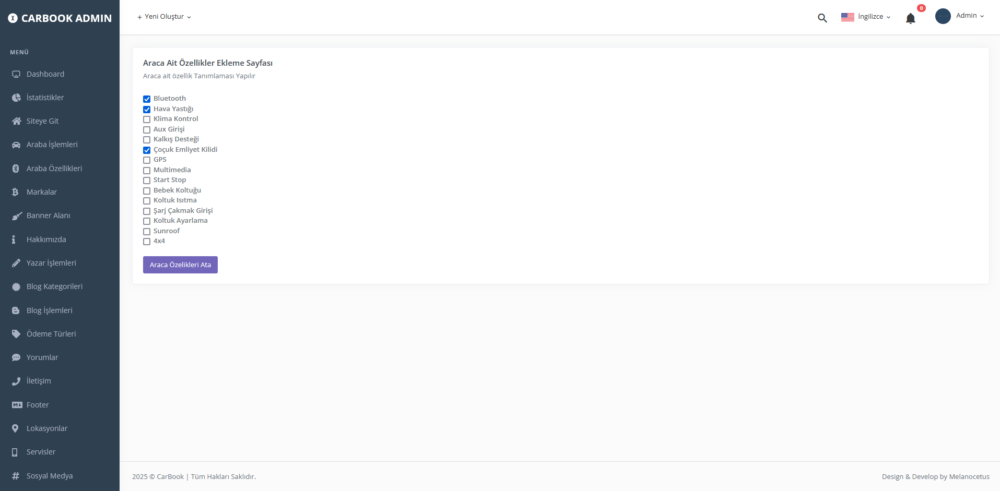
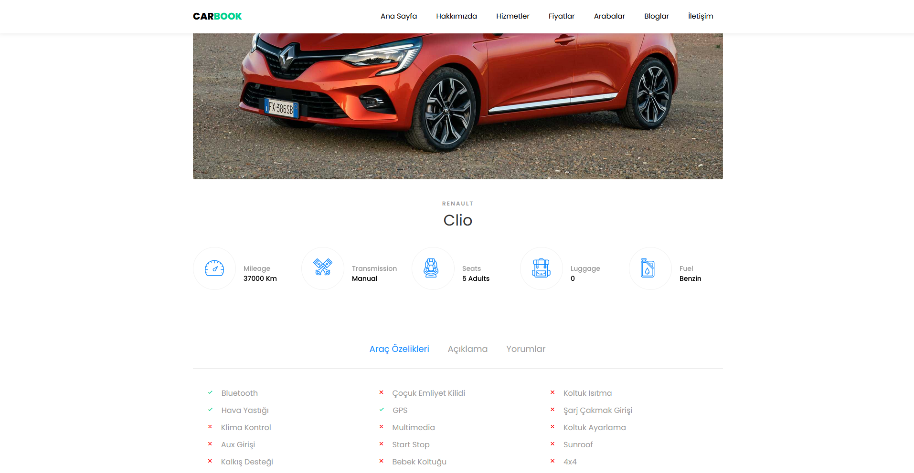
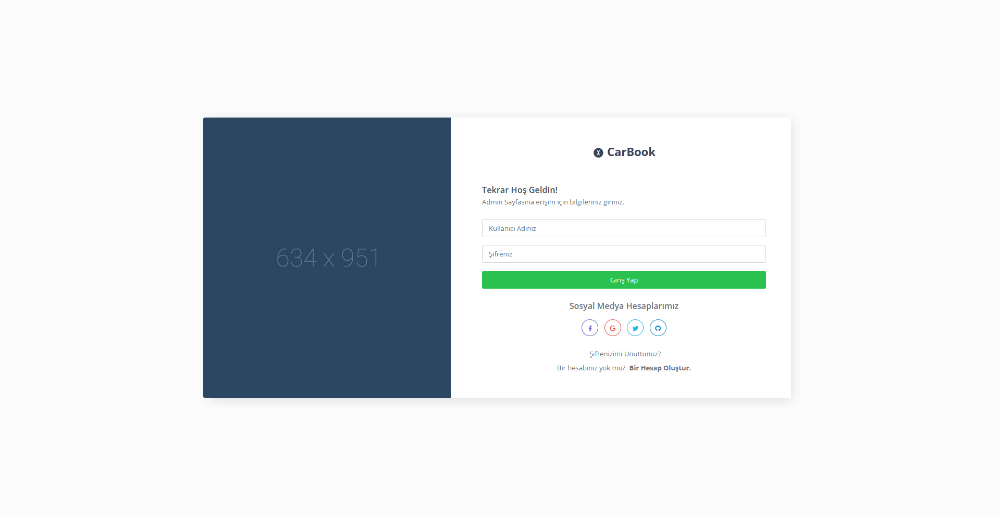

# CarBook - Onion Mimarisi ile CQRS, Mediator ve Repository Deseni

**CarBook**, **ASP.NET Core** kullanılarak geliştirilmiş ve katmanlı mimari ile tasarım desenlerini keşfetmeyi ve uygulamayı amaçlayan bir projedir. Bu proje, **Onion Mimarisi**, **CQRS (Command Query Responsibility Segregation)**, **Mediator** ve **Repository** tasarım desenlerini içerir.

Projenin temel amacı, yazılım geliştirme süreçlerinde bu desenlerin nasıl entegre edileceğini ve doğru şekilde nasıl uygulanacağını öğrenmektir. **Mediator** deseni ile uygulamanın iş mantığı, komutlar ve sorgular arasındaki bağımsızlık sağlanırken, **Repository** deseni ile veri erişimi katmanı ayrıştırılmıştır.

## Ana Özellikler:
- **Onion Mimarisi**: Modüler ve sürdürülebilir yapı ile uygulama geliştirme.
- **CQRS**: Komut ve sorgu işlemlerinin ayrılması, daha temiz ve ölçeklenebilir bir mimari.
- **Mediator Deseni**: İş mantığı, komutlar ve sorgular arasında gevşek bağlılık sağlar.
- **Repository Deseni**: Soyutlanmış veri erişimi ve geliştirilmiş test edilebilirlik.

## Kullanılan Teknolojiler:
- **ASP.NET Core**: Web API geliştirme için kullanılan modern bir framework.
- **C#**: Yazılım geliştirme dili.
- **Entity Framework Core**: Veri erişimi ve ORM (Object-Relational Mapping) aracı.
- **Mediator**: Uygulama içindeki farklı bileşenlerin birbirinden bağımsız olmasını sağlayan bir tasarım deseni.
- **CQRS**: Komut ve sorguların ayrı tutulması prensibini takip eder.
- **JWT Bearer Authentication**: Güvenli API erişimi sağlamak için kullanılan token tabanlı kimlik doğrulama yöntemi.
  
## Ekran Görüntüleri

## Proje Amacı
Bu proje, yazılım geliştirme ve tasarım desenleri kullanarak daha temiz, modüler ve sürdürülebilir uygulamalar geliştirmeyi öğretmeyi amaçlamaktadır. Katmanlı mimari ve tasarım desenleri, uygulamanın daha kolay yönetilmesini ve genişletilmesini sağlar.
